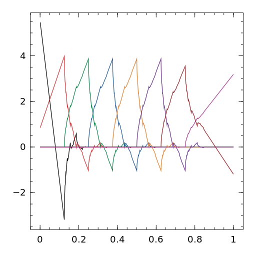

# IntervalWavelets

[](https://travis-ci.org/robertdj/IntervalWavelets.jl)
[](https://codecov.io/github/robertdj/IntervalWavelets.jl?branch=master)

*IntervalWavelets* is a Julia package for computing ordinary/interior Daubechies scaling functions and the moment preserving boundary scaling functions of Cohen, Daubechies and Vial.
See the [enclosed document](doc/boundary_wavelets.pdf) for further description of these functions.


## Installation

In Julia, run

```julia
Pkg.add("IntervalWavelets")
```

To load the package after a successful installtion, run `using IntervalWavelets`.


## Scaling functions

A Daubechies scaling function is defined by a filter that is related to the number of vanishing moments of the associated wavelet.
**In the following `p` denotes the number of vanishing moments of the wavelet**.

A filter for the ordinary/interior Daubechies scaling function is computed as

```julia
C = ifilter(p)
```

A second, boolean argument determines whether or not to use the linear phase (`true`) or minimum phase (`false`) scaling function; the default is `true`.

Except for the explicit [Haar wavelet](https://en.wikipedia.org/wiki/Haar_wavelet), Daubechies scaling functions can only be calculated at the [dyadic rationals](https://en.wikipedia.org/wiki/Dyadic_rational), i.e., points of the form k/2^R for R >= 0.
In *IntervalWavelets* we refer to R as the *resolution* of the dyadic rationals.
A Daubechies scaling function defined by a filter `C` is evaluated at all dyadic rationals of resolution R in its support with the command

```julia
y = DaubScaling(C, R)
```

Alternatively, use

```julia
x, y = DaubScaling(p, R)
```

that also returns the points where the function is evaluated.
To plot the function with e.g. [Winston](https://github.com/nolta/Winston.jl), use
`plot(x,y)`.

For `p` vanishing moments there is also `p` left and `p` right scaling functions.
Their filters are available with as

```julia
L = bfilter(p, 'L')
R = bfilter(p, 'R')
```

If `B` denotes either `L` or `R` above and `C` is the interior filter with linear phase, the `p` boundary functions evaluated at the dyadic rationals of resolution R are returned as columns in the matrix `Y` with the command

```julia
Y = DaubScaling(B, C, R)
```

Alternatively,

```julia
x, Y = DaubScaling(p, 'L', R)
x, Y = DaubScaling(p, 'R', R)
```

returns the points where the functions are evaluated, as for the interior scaling function.
The functions can be plotted all at once with `plot(x, Y)`.


To collectively compute all scaling functions at scale `J` at resolution `R`, use

```julia
Y = IntervalScaling(p, J, R)
```


## A note on indices

In the output of 

```julia
x, Y = DaubScaling(p, 'L', R)
```

The `p` left boundary scaling functions are ordered such that the first column of `Y` contains the functions "closest" to the boundary, i.e., with support [0,p].
This is consistent with the chosen indexing of the boundary scaling functions.

To be consistent with the indexing, the columns of `Y` in

```julia
x, Y = DaubScaling(p, 'R', R)
```

are again ordered such that the first column has the lowest index and is closest to the boundary, i.e., has support [-p,0].

However, when traversing the columns of `Y` from

```julia
Y = IntervalScaling(p, J, R)
```

I think it is natural that the lower the column index is, the more to the left should the function be.
I.e., the first `p` functions are the left boundary functions, then comes the `2^J-2p` translated interior functions and then comes the `p` right boundary functions, *ordered opposite than the output of `DaubScaling`*.

A plot of the 8 scaling functions at level 3 associated with a wavelet with 2 vanishing moments:

```julia
using Winston
x = dyadic_rationals(DaubSupport(0,1), 10);
Y = IntervalScaling(2, 3, 10);
plot(x, Y)
```

The purple function to the right is the last column of `Y`, `Y[:,8]`.




## Compute representations

A representation of a 1D or 2D function in a scaling function basis is a vector or matrix of coefficients with respect to that basis.
The reconstruction of the function from this array is a linear combination of scaling functions.
In *IntervalWavelets* reconstructions are computed on the unit interval.

Let J be an integer > 0 and `coeff` be a vector of length 2^J or a quadratic matrix with 2^J rows & columns.
(For a random, uniformly distibuted vector use `coeff = rand(2^J)` and for a ditto matrix use `coeff = rand(2^J, 2^J)`.)
To compute the reconstruction in the Haar basis in the dyadic rationals of resolution `R`, use

```julia
f = weval(coeff, R)
```

To compute the reconstruction with Daubechies scaling functions at resolution `R`, use

```julia
f = weval(coeff, p, R)
```

A 1D function can be plotted as mentioned above.
A 2D image can be displayed with Winston using `imagesc(f)`.


## Miscellaneous

A lot of the testing is based on computing inner products in L^2([0,1]) and to do this a couple of functions are included:

- `trapezquad(x, y)`: Integrate `y` over `x` using the [trapezoidal rule](https://en.wikipedia.org/wiki/Trapezoidal_rule). 
- `inner(x, y, z)`: The L2 inner product of `y` and `z` over `x`.
- `l2norm(x, y)`: The L2 norm of `y` over `x`.

The trapezoidal rule is not very accurate, but it is easy to implement and higher order methods will (probably) not yield better results for the unsmooth scaling functions.

