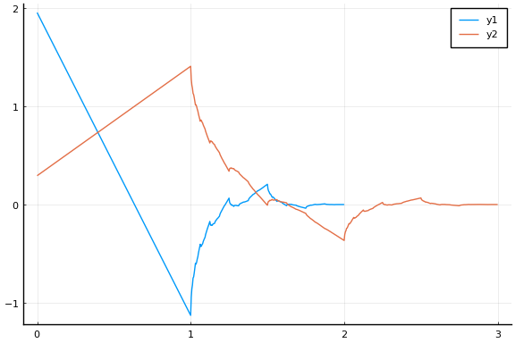
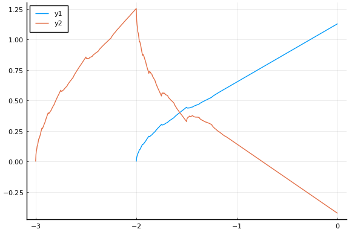

IntervalWavelets
================

[](https://travis-ci.org/robertdj/IntervalWavelets.jl)
[](https://codecov.io/github/robertdj/IntervalWavelets.jl?branch=master)

*IntervalWavelets* is a Julia package for computing ordinary/interior Daubechies scaling functions and the moment preserving boundary scaling functions of Cohen, Daubechies and Vial.
See the [enclosed document](doc/boundary_wavelets.pdf) for further description of these functions.


# Installation

Switch to `Pkg` mode in Julia with `]` and run

````julia

add IntervalWavelets
````


# Scaling functions

Except for the explicitly defined [Haar wavelet](https://en.wikipedia.org/wiki/Haar_wavelet), Daubechies scaling functions can only be calculated at the [dyadic rationals](https://en.wikipedia.org/wiki/Dyadic_rational), i.e., rational numbers of the form k/2^R (where R >= 0).
In *IntervalWavelets* we refer to R as the *resolution* of the dyadic rationals.

Let us first load *IntervalWavelets* as well as the [Plots package](https://github.com/JuliaPlots/Plots.jl).

````julia
using IntervalWavelets
using Plots
````


The ordinary Daubechies scaling functions are called *interior* scaling functions in *IntervalWavelets*.
An interior scaling function is defined using a filter where we specify the number of vanishing moments and the phase.
A second argument for `interior_filter` specifies the phase to be either minimum or symmlet (the default).

Besides the filter we specify the resolution at which we wish to compute the scaling function:

````julia

h = interior_filter(2)
phi = interior_scaling_function(h, 8)
plot(phi)
````


The scaling function `phi` can be evaluated in all dyadic rationals (where it is computed).
As an example we evaluate `phi` in -0.5:

````julia

phi(DyadicRational(-1, 1))
````


````
0.9330127018921028
````


The boundary scaling functions are either modified near the left or right side of their support.
The side is specified with an enum with values `LEFT` and `RIGHT`.
There is no choice of filter for the boundary scaling functions so we just specify the number of vanishing moments and the resolution of the scaling functions:

````julia

L = boundary_scaling_functions(LEFT, 2, 8)
plot(L)
````





Similarly, we get the right boundary scaling functions:

````julia

R = boundary_scaling_functions(RIGHT, 2, 8)
plot(R)
````





The boundary scaling functions are indexed from 0 through `p - 1`, where `p` is the number of vanishing moments.

````julia

L[0]
````


````
Left scaling function number 0 with 2 vanishing moments at resolution 8
````


Just as the interior scaling functions the individual boundary scaling functions can be evaluated in all dyadic rationals.


# Reconstruction

A basis of scaling functions is computed by specifying the number of vanishing moments (here 2), the scale of the functions (here 3) and their resolution (here 8):

````julia

B = interval_scaling_function_basis(2, 3, 8)
plot(B)
````


By default, the basis is on the interval [0, 1], but this can be specified with optional arguments.
The basis functions are indexed from 1 through `2^J` where `J` is the scale.
We do not return the *functions* as above, but the function *values* in the support.
This is to make reconstruction faster.

From a set of coefficients representing a function in a basis we can compute its reconstruction.

````julia
x, y = reconstruct(B, ones(8));
````


If the coefficients are a matrix the reconstruction is also a matrix (representing an image). 


# Weave

This README is generated with the [Weave package](https://github.com/JunoLab/Weave.jl) using the command 

````julia

weave("README.jmd", doctype = "github", fig_path = "figures")
````

